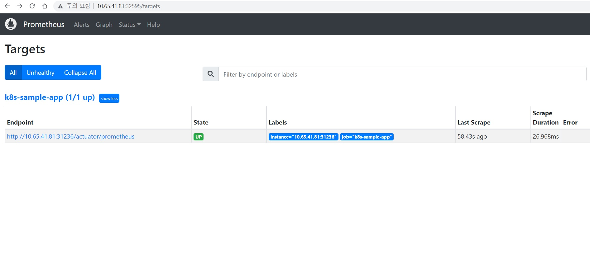

# prometheus 구성

## prometheus 설치

설치는 Helm 을 통해 진행함.

### prometheus helm 설치
```text
# helm 으로 repo 추가 및 설치
helm repo add prometheus-community https://prometheus-community.github.io/helm-charts
helm install prometheus prometheus-community/prometheus -n monitoring
```
### prometheus spring actuator 설정 설치
* Actuator 설정된 SpringBoot 서비스포트, Metric URI 정보필요 
```text
# helm chart git clone 후 value 추가 후 설치
git clone https://github.com/prometheus-community/helm-charts
vi ./charts/prometheus/values.yaml
    scrape_configs:
      - job_name: prometheus
        static_configs:
          - targets:
            - localhost:9090
      //추가부분(springboot application endpoints)      
      - job_name: k8s-sample-app
        metrics_path: /actuator/prometheus
        static_configs:
          - targets:
            -  10.65.41.81:31236
# prometheus 설치
helm install -n monitoring prometheus -f values.yaml .            
```
### prometheus pvc  생성

* prometheus는 helm 설치시 기본적으로 server/alertmanager 두개의 데이터 저장공간이 필요

```text
# pv/pvc 생성
kubectl create -f prometheus-pv.yaml
kubectl create -f prometheus-pvc.yaml
kubectl create -f prometheus-alertmanager-pv.yaml
kubectl create -f prometheus-alertmanager-pvc.yaml

# pvc 생성확인
kubectl get pvc -n monitoring
NAME                      STATUS   VOLUME                       CAPACITY   ACCESS MODES   STORAGECLASS   AGE
prometheus-alertmanager   Bound    prometheus-alertmanager-pv   10Gi       RWX                           47h
prometheus-server         Bound    prometheus-server-pv         10Gi       RWX                           47h

```
### prometheus svc 변경

* 외부접속을 위해 service를 NodePort로 변경

```text
kubectl -n monitoring  patch svc/prometheus-server -p '{"spec":{"type":"NodePort"}}
kubectl get svc -n monitoring
NAME                 TYPE        CLUSTER-IP      EXTERNAL-IP   PORT(S)        AGE
prometheus-server   NodePort    10.101.30.136    <none>        80:32595/TCP   47h
[root@wspark-kube-mas01 ~]# 
```

### prometheus 접속

* 브라우져로 http://${k8s클러스터IP:32595}


### Prometheus 수집확인

* prometheus dashboard 접속 -> Target 



* custom metric 확인(어플리케이션에서 제공되는 metric)


## Reference 참고 링크
* [prometheus install](https://github.com/prometheus-community/helm-charts)
* [prometheus actuator](https://www.tutorialworks.com/spring-boot-prometheus-micrometer/)
