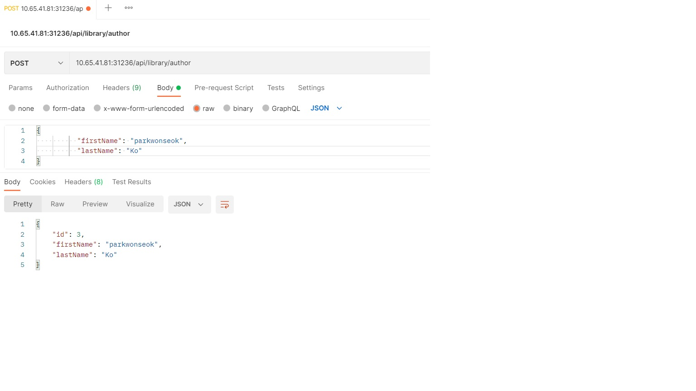
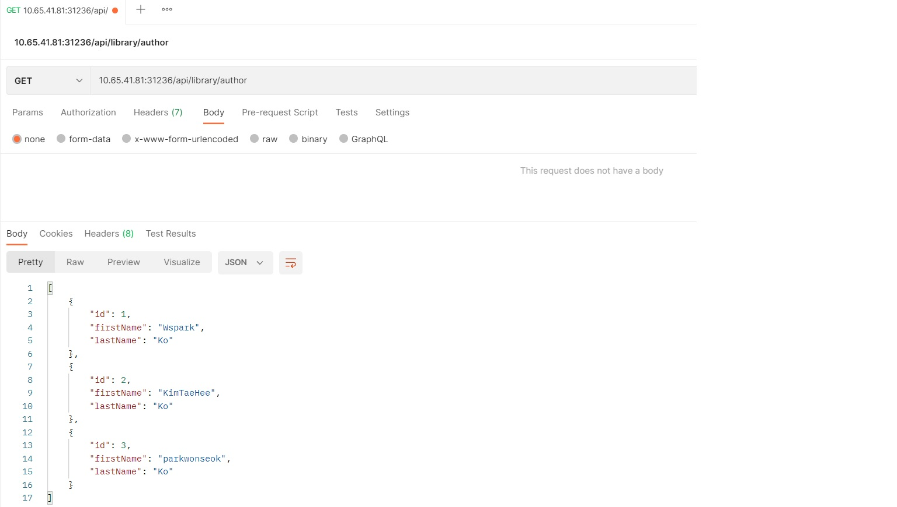

# SpringBoot 어플리케이션 구현 및 배포

* 도서대출 API 목록

| URI                        | HTTP 메서드 |          설명           |
| :----------                | :----------:| :----------------------:|
|/api/library/book           |   GET       |  도서 전체 조회          |
|/api/library/book?isbn=1919 |   GET       |  도서 ISBN으로 도서 조회 |
|/api/library/boot/:id       |   GET       |  도서ID로 조회           |
|/api/library/book           |   POST      |  도서 등록               |
|/api/library/boot/:id       |   DELETE    |  도서 삭제               |
|/api/library/book/lend      |   POST      |  도서 대출               |
|/api/library/member         |   GET       |  회원 전체 조회          |
|/api/library/member/:id     |   GET       |  회원ID로 조회           |


## Custom API Endpoint 추가

### Actuator 설정
* application.properties에 endpoint 지정하면 /actuator/prometheus로 Metric을 노출한다.
```text
spring.datasource.url=jdbc:mysql://10.65.40.100:3306/wspark
spring.datasource.username=root
spring.datasource.password=paasword
spring.jpa.hibernate.ddl-auto=update
management.endpoints.web.exposure.include=health,info,prometheus //추가
```

* Timed 어노테이션을 Controller 단에 추가하여 API 메서드의 수행시간을 알 수 있음

```text
LibraryController.java
import io.micrometer.core.annotation.Timed;

    @Timed(value = "get-author") //추가부분으로 get-author으로 prometheus가 수집
    @GetMapping("/author")
    public ResponseEntity<List<Author>> readAuthors () {
        return ResponseEntity.ok(libraryService.readAuthors());
    }
```
### SpringBoot 어플리케이션 컨네이너 이미지 만들기

* springboot 소스 빌드
```text
# springboot pom.xml경로에서 gradle 빌드
gradle build

```
* Dockerfile
```text
## 소스를 내부 컨테이너에 복사하여 java로 기동
FROM wspark83/springboot:openjdk8-custom

# maintainer
LABEL maintainer="jjomacson@gmail.com"
# timezone setting
ENV TZ=Asia/Seoul
# root user
USER root
# for application log
RUN mkdir -p /logs
# gradle
ARG JAR_FILE=build/libs/springboot-sample-0.0.1-SNAPSHOT.jar
# maven
#ARG JAR_FILE=target/springboot-sample-0.0.1-SNAPSHOT.jar

COPY ${JAR_FILE} /app.jar

RUN chown jboss:root /logs
RUN chown jboss:root /app.jar

# jboss user
USER 185

EXPOSE 8080

ENTRYPOINT ["java","-jar","/app.jar"]
```

* 컨테이너 이미지 빌드하고 이미지저장소에 Push

```text
# 환경변수 확인(이미지 Repository/IMAGE_NAME/TAG) 
./script/env.sh
#!/bin/sh
export CONTAINER_NAME=springboot-demo-v1.0
export IMAGE_NAME=wspark83/springboot
export REGISTRY="docker.io"
export TAG=demo-v1.0

#컨테이너 이미지 빌드 및 Push
# build.sh 내용
#!/bin/sh
. ./env.sh
buildah bud --format=docker -t ${REGISTRY}/${IMAGE_NAME}:${TAG} ../
buildah login -u wspark83 -p $password ${REGISTRY}
buildah push  ${REGISTRY}/${IMAGE_NAME}:${TAG} 

#build.sh 실행
$ ./build.sh

- buildah 실행안되는 경우 binary 설치 필요(podman/docker로 변경가능)
```


### k8s에서 배포하기

```text
# namespace 생성
kubectl create namespace wspark

# deployment 생성
kubectl create deployment springboot-demo --image docker.io/wspark83/springboot:demo-v1.0  -n wspark

# 외부접속용 svc nodeport 변경
kubectl expose deployment springboot-demo --port 8080 --target-port 8080 --type NodePort -n wspark

# nodeport 확인
kubectl get svc -n wspark
NAME              TYPE       CLUSTER-IP      EXTERNAL-IP   PORT(S)          AGE
springboot-demo   NodePort   10.101.65.210   <none>        8080:31236/TCP   2d1h

# 호출
curl 10.65.41.81:31236/api/library/author
[{"id":1,"firstName":"Wspark","lastName":"Ko"},{"id":2,"firstName":"KimTaeHee","lastName":"Ko"},{"id":3,"firstName":"parkwonseok","lastName":"Ko"}]
```


## API 확인

* Author 추가


* Author 리스트 확인



## Reference 참고 링크
* [start.spring.io](https://start.spring.io/)
* [javatodev](https://javatodev.com/spring-boot-mysql)
* [velog.io](https://velog.io/@windsekirun/Spring-Boot-Actuator-Micrometer%EB%A1%9C-Prometheus-%EC%97%B0%EB%8F%99%ED%95%98%EA%B8%B0)

